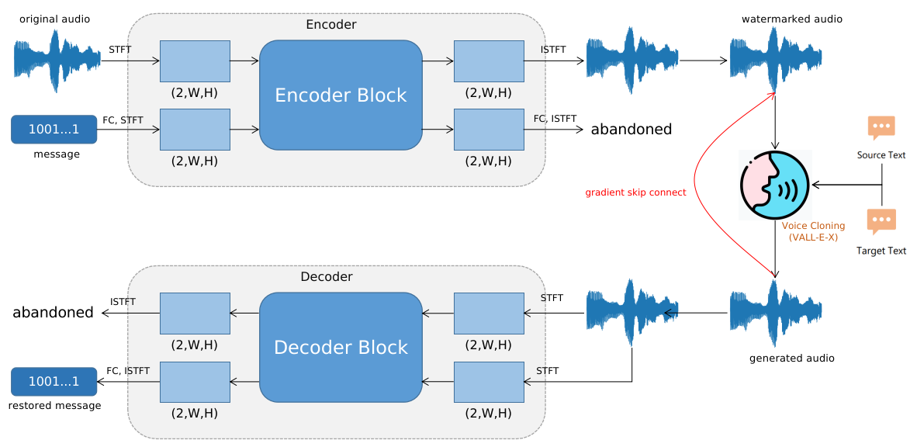
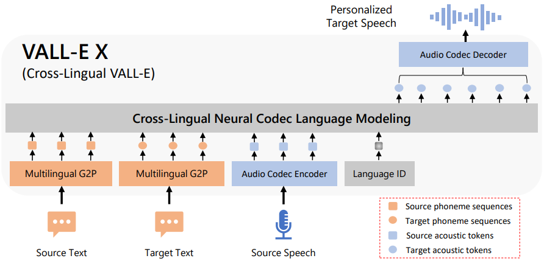

# Watermarking for Voice Cloning

This repo has two experiments, one for [voice cloning](https://github.com/ObsisMc/watermarking/tree/main) and 
the other for [multiple watermarks](https://github.com/ObsisMc/watermarking/tree/multiwm).
Voice Cloning is in `main` branch and multiple watermarks is in `multiwm` branch.

## Introduce

This work tries to add a watermark into audio, then if a voice cloning model like VALL-E-X uses the audio
to generate another audio, we can detect a watermark from the generated audio. The model we designed is a 
plugin model and is decoupled from any voice cloning model, so you can train it with other voice cloning models
easily and adopt it in these voice cloning models. In this way, we can mitigate the societal risks like voice scams.

Our model refers to [Wavmark](https://github.com/wavmark/wavmark). However, we modified it and 
replaced the attack module with a voice cloning module, especially VALL-E-X. We also wrote training code to train
the model referring to [Pixinwav](https://github.com/migamic/PixInWav2). 
Since [official VALL-E-X](https://arxiv.org/pdf/2303.03926.pdf) isn't open-source, 
we adopted another available [VALL-E-X](https://github.com/Plachtaa/VALL-E-X) implementation.

## Model Architecture

### Our model
Similar to Wavmark, the architecture is shown in Figure 1. We use VALL-E-X to transform 
the watermarked audio and try to detect the watermark in the generated audio.

Figure.1

### VALL-E-X

This model is a TTS model (Figure 2, from [VALL-E-X paper](https://arxiv.org/pdf/2303.03926.pdf)) which needs a clip of source audio (audio to be cloned), 
a source text (the transcript of the source audio), and a target text (the transcript of generated audio)
to generate audio that has the same tone as yours.

Figure.2

## Training Strategy

Since it is a plugin model, it doesn't need to care about the implementation of voice cloning models.
Therefore, as shown in Figure 1, we adopted a gradient skip connection to skip the gradient calculation
in the voice cloning models.

We used a pre-trained VALL-E-X and froze its parameters.

## Repository Outline
Important directory

- `src/`:
  - `main.py`: entry point for training, only the following args are unavailable
    - `dtw`, `stft_small`, `ft_container`, `thet`, `mp_encoder`, `mp_decoder`, `mp_join`
        `permutation`, `embed`, `luma`
  - `train.py`: training code
  - `umodel.py`: the model class
  - `loader.py`: dataset class
  - `preprocessor.py`: to build the dataset for training based on LibriSpeech
- `scripts/`: for training
  - `run_train_multiwm.sh`: training model above
  - `run_train_multiwm_share.sh`: encoder and decoder have shared parameters
- `watermark_voice_clone.ipynb`: for testing code in a more clear way
- VALL-E-X's code:
  - `data/`
  - `models/`
  - `modules/`
  - `utils/`
  - `macros.py`

## Installation

Refer to [Pixinwav](https://github.com/migamic/PixInWav2), [Wavmark](https://github.com/wavmark/wavmark)
and [Plachtaa's VALL-E-X](https://github.com/Plachtaa/VALL-E-X). You can also use `envirnoment.yaml` to install
dependencies.

This project runs in Python 3.10. We use `wandb` to log the training progress.

Pay attention: whisper needs ffmpeg to read audio files, if you don't have it and cannot install it,
you can replace the original code with `torchaudio.load()`

## Usage
### Dataset
This work processed LibriSpeech dataset and used a customized dataset. You can use `src/preprocessor.py` to
build the dataset.

### Training
Replace variables in `.env` to set up your default path.

Run `scripts/run_trainVC.sh` to train.

## Thanks
- [Wavmark](https://github.com/wavmark/wavmark): Model's architecture is based on Wavmark.
- [Pixinwav](https://github.com/migamic/PixInWav2): Training code refers to Pixinwav.
- [Plachtaa's VALL-E-X](https://github.com/Plachtaa/VALL-E-X): VALL-E-X code.