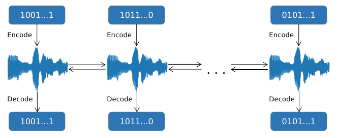
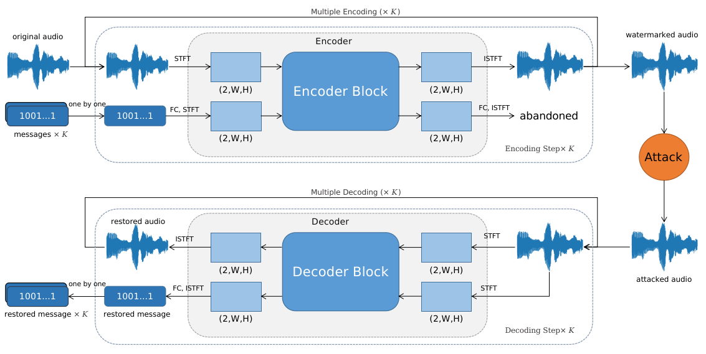
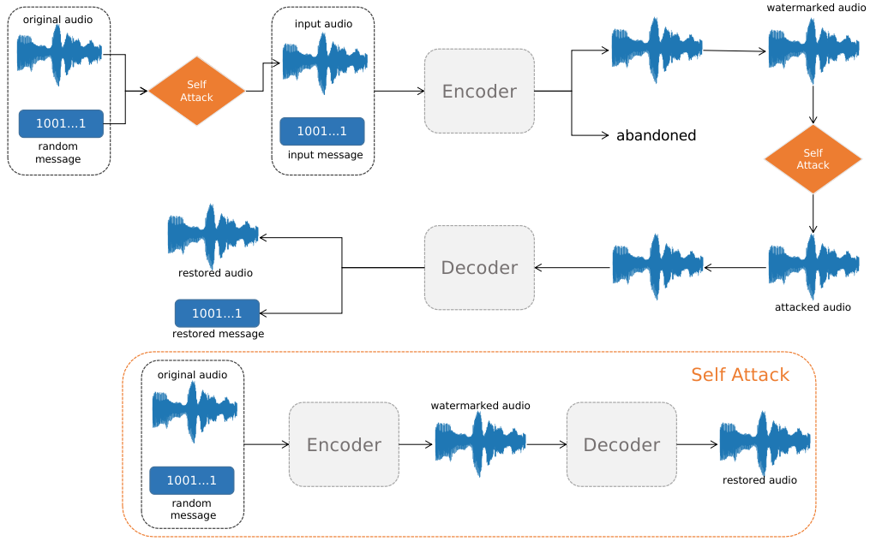

# Encoding Multiple Watermarks in Audio
> The model is based on [Wavmark](https://github.com/wavmark/wavmark)

This work tries to encode multiple short messages into audio, then decode them and get restored messages one by one.

This method has two advantages:
1. Training a model that encodes a long message into audio may need much time, while this method only need to train a 
model that encodes a relatively short message.
2. With this method, the length of watermark isn't fixed and is flexible, which means we can add as many messages as 
we want if the model is trained well.

## Model Architecture

We only use one encoder and one decoder to add and detect the watermark. However, encoding step will 
repeat several times so multiple watermarks are added into audio and similarly, decoding step also repeat several times
and these watermarks will be detected.

## Training Strategy

We replace the attack module with a self-attack module that is our whole watermarking model and receives random 
messages. Before encoding original audio, we also set a self-attack module. The encoder and decoder in self-attack module
share the parameters of those two in the watermarking model and they will be trained at the same time. 

## Repository Outline
Important directory

- `src/`:
  - `main.py`: entry point for training, only the following args are unavailable
    - `dtw`, `stft_small`, `ft_container`, `thet`, `mp_encoder`, `mp_decoder`, `mp_join`
        `permutation`, `embed`, `luma`
  - `train.py`: training code
  - `umodel.py`: the model class
  - `loader.py`: dataset class
  - `preprocessor.py`: to build the dataset for training based on LibriSpeech
- `scripts/`: for training
  - `run_train_multiwm.sh`: training model above
  - `run_train_multiwm_share.sh`: encoder and decoder have shared parameters
- 
## Installation
Refer to [Pixinwav](https://github.com/migamic/PixInWav2) and [Wavmark](https://github.com/wavmark/wavmark).
You can also use `envirnoment.yaml` to install dependencies.

This project runs in Python 3.10. We use `wandb` to log the training progress. 

## Usage
### Dataset
We used `src/preprocessor.py` to process LibriSpeech and built a customized dataset. 
Though this experiment don't need texts like voice cloning models, you still need to build such a 
dataset.

### Training
Replace variables in `.env` to set up your default path.

Run `scripts/run_train_multiwm.sh` to train.

## Thanks
- [Wavmark](https://github.com/wavmark/wavmark): Model's architecture is based on Wavmark.
- [Pixinwav](https://github.com/migamic/PixInWav2): Training code refers to Pixinwav.